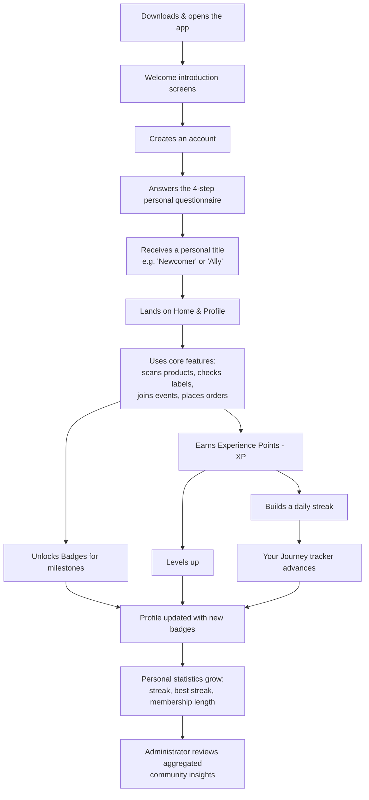
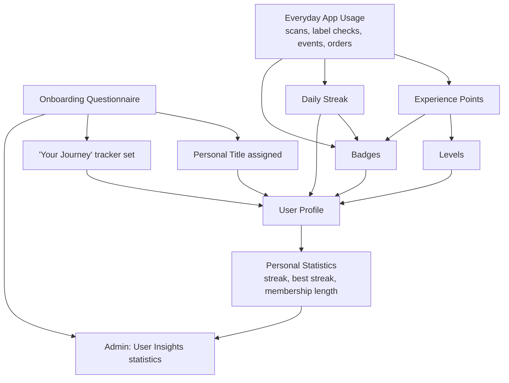

# The Glutenia Engagement & Gamification System

*A plain-language overview of how Glutenia motivates, rewards, and keeps its users engaged.*

---

> 📘 **About this document**
>
> This report explains, in simple terms, the different mechanisms built into the Glutenia mobile application to make it more engaging, motivating, and rewarding to use. It is written for a general audience — no technical background is required to understand it.

---

## 1. Introduction

**Gamification** is the practice of taking ideas that make games fun and satisfying — points, levels, badges, progress bars, streaks — and applying them to something that isn't a game. The goal is not to turn an application into a toy, but to make everyday use of it feel more rewarding, more personal, and easier to stick with.

Most successful modern apps use some form of gamification. Fitness apps reward you for working out. Language-learning apps reward you for practicing every day. Even simple to-do list apps often show a small sense of accomplishment when a task is checked off.

Glutenia is a mobile application built for people who live with celiac disease or gluten intolerance, or who support someone who does. Its core purpose is practical: helping people scan products, check ingredient labels, find gluten-free shops and events, and shop safely. But living gluten-free is a long-term, everyday commitment — not a one-time task. That is exactly the kind of situation where gamification adds real value: it turns a series of small, repeated, sometimes tedious actions (checking a label, scanning a barcode) into a visible, rewarding journey.

Gamification was added to Glutenia to:

- make the app feel more alive and personal, not just functional
- give users a reason to come back regularly, not just when they need something
- turn everyday safety habits (like checking labels) into something that feels like progress rather than a chore
- help new users feel guided and understood from their very first use of the app

---

## 2. Objectives of the Gamification System

The system was designed around a small number of clear goals:

| Objective | What it means in practice |
|---|---|
| **Motivating users** | Give people a reason to keep using the app beyond pure necessity. |
| **Encouraging regular use** | Reward consistency (using the app day after day), not just one-off actions. |
| **Making progress visible** | Show users, clearly and simply, how far they've come since they started. |
| **Rewarding achievements** | Recognize meaningful milestones (first scan, first order, first event) with something tangible. |
| **Creating a more enjoyable experience** | Turn routine safety habits into small, satisfying moments instead of dry chores. |
| **Personalizing the experience** | Adapt the app's tone and guidance to who the person actually is and where they are in their journey. |

> 💡 **Why this matters for a health-related app**
>
> Because gluten-free living is a daily commitment, not a one-time decision, keeping people engaged over the long run is arguably more important here than in many other types of apps. A user who stops opening the app is a user who stops benefiting from it.

---

## 3. User Journey

Below is the path a typical user follows from the moment they open Glutenia for the first time, including every step that connects to engagement, motivation, or progress.

> 🖼️ **[ Insert image here: full-page "User Journey" illustration ]**
>
>
>
>

Every one of these steps is described in more detail in the sections that follow.

---

## 4. Onboarding Questionnaire

When a new user creates an account, before they reach the main app, they are guided through a short, friendly, **4-step personal questionnaire**. This is far more than a formality — it is one of the most important engagement tools in the entire app, even though it doesn't look like a typical "gamification" feature at first glance.

### Why it exists

The questionnaire exists to understand who the person is and where they stand, so that the rest of the app can adapt to them instead of treating every user the same way.

### What it asks

| Step | Question | Purpose |
|---|---|---|
| 1. Role | *"Which best describes you?"* — Gluten-Free Warrior or Supporter | Understands whether the person is managing their own gluten-free life, or supporting someone else (like a parent supporting a child). |
| 2. Journey | *"How long have you been gluten-free?"* (or *"...supporting someone?"*) | Understands their experience level — brand new, or years of experience. |
| 3. Goal | *"What's your main reason for using Glutenia?"* | Understands their motivation — managing a diagnosed condition, supporting a family member, or simply making a dietary choice. |
| 4. Confidence | *"How confident are you at identifying gluten?"* | Understands how much guidance and reassurance they may need. |

### How it connects to everything else

This is the key point: **the answers to this short questionnaire quietly power several other parts of the app.**

- It immediately gives the user a **personal title** (explained in the next section), so the app feels personalized from the very first minute.
- It sets the starting point on the **"Your Journey" progress tracker** shown on the profile page — a five-stage visual path (*Beginner → Aware → Safe Eater → Fighter → Titan*) that reflects how far along someone is.
- It contributes to **community-wide statistics** that the administrator can see (explained in Section 9) — for example, understanding how many users are new versus experienced, or what motivates people to use the app.
- Completing it for the first time is itself rewarded with Experience Points (see Section 5).

> 💡 **In short:** the questionnaire is not just a form to fill in — it's the moment the app starts personalizing itself around the real person using it.

> 🖼️ **[ Insert image here: the 4-step questionnaire screens ]**
>
>
>
>

---

## 5. Experience Points (XP)

### What XP represents

Experience Points, or **XP**, are a simple running score that represents how actively someone has used the app. Every time a user does something meaningful — checking a product, reading a label, joining an event, placing an order — they earn a small number of points.

### How users earn XP

| Action | What it means | XP earned |
|---|---|---|
| Scanning a product barcode | Checking whether a product is safe | +5 XP |
| Scanning an ingredient label | Verifying ingredients using the app's label reader | +10 XP |
| Joining a community event | RSVPing to attend an event | +25 XP |
| Placing an order | Buying gluten-free products through the app | +40 XP |
| Completing the personal questionnaire | Finishing onboarding for the first time | +50 XP (one-time only) |

### Why XP is useful

XP gives the user immediate, small feedback for doing something useful. It turns an invisible action ("I checked a label") into something visible and acknowledged ("+10 XP"). Over time, this running total becomes a simple, honest reflection of how engaged someone has been with their gluten-free safety habits.

### Why XP reflects participation, not competition

It is important to note that Glutenia's XP is **personal, not competitive.** There is no leaderboard pitting users against each other, and no ranking system. XP is not about being "better" than someone else — it exists purely to give each person their own sense of progress, at their own pace. This fits the nature of the app: gluten-free living is a personal journey, not a contest.

> 🖼️ **[ Insert image here: XP toast / "+XP" pop-up example ]**
>
>
>
>

---

## 6. Levels

### How levels work

As a user accumulates XP, they gradually move up through **Levels**. Each level requires a certain amount of total XP to reach, and the app displays a simple progress bar showing how close the user is to their next level.

### Why users level up

Levels exist to summarize XP into something even simpler and more satisfying than a raw number. "Level 4" is easier to feel proud of than "1,240 points" — it condenses ongoing effort into clear, memorable milestones.

### What leveling means

A higher level simply means a longer history of meaningful activity in the app. It doesn't unlock new functionality — its value is entirely about recognition and motivation.

### Why levels motivate continued use

Levels create a sense of forward momentum. Because the app always shows "how close you are to the next level," users are gently encouraged to take just one more action (one more scan, one more label check) to close that gap — the same psychological principle that makes fitness apps and language apps so effective at keeping people coming back.

> ℹ️ **A personal note alongside Levels**
>
> Separately from the numeric Level, every user also carries a **personal title** — for example *"Newcomer," "Explorer," "Label Reader," "Safe Eater,"* or *"Advocate"* for someone managing their own gluten-free life, and *"Ally," "Caregiver," "Protector," "Champion,"* or *"Lifeline"* for someone supporting another person. This title comes from the onboarding questionnaire (Section 4) and grows as the person's experience level increases. Where the numeric Level reflects *activity*, the title reflects *identity and experience* — the two work side by side.

> 🖼️ **[ Insert image here: Level / XP progress bar on the profile screen ]**
>
>
>
>

---

## 7. Badges

Badges are the most visible and most personal reward in Glutenia. Each badge celebrates a specific, meaningful milestone — a first action, a habit forming, or a long-term commitment.

### Badge rarity

Every badge belongs to one of four **rarity tiers**, shown through color and visual styling. The tier communicates, at a glance, how significant the achievement is:

| Tier | What it represents |
|---|---|
| 🥉 **Bronze** | A first step — the very first time someone does something. |
| 🥈 **Silver** | A habit forming — doing something several times. |
| 🥇 **Gold** | Real commitment — sustained, meaningful effort. |
| 💎 **Platinum** | Long-term mastery — the rarest, most impressive milestones. |

Badges the user hasn't earned yet are shown in **grey, dimmed** style with a small lock icon, so it's always visually obvious what has and hasn't been achieved. Once earned, a badge becomes fully colorful and vibrant — a small, satisfying visual reward in itself.

> 🖼️ **[ Insert image here: side-by-side comparison of a locked badge vs. an unlocked badge ]**
>
>
>
>

Below is every badge currently in the application, grouped by the type of activity it celebrates.

---

### 7.1 Scanner Badges — *rewarding safe checking habits*

#### First Scan 🥉

> 🖼️ **[ Insert badge artwork here: "First Scan" ]**
>
>
>
>

- **Badge Name:** First Scan
- **Description:** You scanned your very first product on Glutenia.
- **Unlock Condition:** Scan 1 product.
- **Purpose:** Celebrates the very first meaningful action a new user takes with the app's core safety tool.
- **Motivational Value:** Gives an immediate sense of accomplishment right after onboarding, reinforcing that "using the app" feels good from minute one.

#### 10 Scans 🥈

> 🖼️ **[ Insert badge artwork here: "10 Scans" ]**
>
>
>
>

- **Badge Name:** 10 Scans
- **Description:** You've scanned ten products to check for gluten.
- **Unlock Condition:** Scan 10 products.
- **Purpose:** Marks the point where scanning starts becoming a genuine habit rather than a one-time trial.
- **Motivational Value:** Encourages the user to keep the habit going past the first try.

#### 50 Scans 🥇

> 🖼️ **[ Insert badge artwork here: "50 Scans" ]**
>
>
>
>

- **Badge Name:** 50 Scans
- **Description:** Scanning has become part of your routine.
- **Unlock Condition:** Scan 50 products.
- **Purpose:** Recognizes that checking products has become part of the user's everyday shopping routine.
- **Motivational Value:** Reinforces long-term, safety-conscious behavior with a meaningful reward.

#### 100 Scans 💎

> 🖼️ **[ Insert badge artwork here: "100 Scans" ]**
>
>
>
>

- **Badge Name:** 100 Scans
- **Description:** A true scanning expert — nothing gets past you.
- **Unlock Condition:** Scan 100 products.
- **Purpose:** Celebrates a power-user level of engagement with the app's most-used feature.
- **Motivational Value:** The rarest scanner badge — a strong statement of loyalty and long-term trust in the app.

---

### 7.2 Safety Badge — *rewarding careful label reading*

#### Label Master 🥇

> 🖼️ **[ Insert badge artwork here: "Label Master" ]**
>
>
>
>

- **Badge Name:** Label Master
- **Description:** You've checked ingredient labels 50 times to stay safe.
- **Unlock Condition:** Check ingredients 50 times.
- **Purpose:** Ingredient-label checking is the single most safety-critical habit in the app; this badge exists to specifically celebrate it.
- **Motivational Value:** Reinforces the exact safety behavior the app most wants to encourage, by giving it its own dedicated recognition.

---

### 7.3 Community Badges — *rewarding participation in events*

#### Event Attendee 🥉

> 🖼️ **[ Insert badge artwork here: "Event Attendee" ]**
>
>
>
>

- **Badge Name:** Event Attendee
- **Description:** You joined your first Glutenia community event.
- **Unlock Condition:** Attend 1 event.
- **Purpose:** Encourages users to step beyond the app itself and engage with the wider gluten-free community.
- **Motivational Value:** Rewards the first, often hardest, step of showing up to something new.

#### Event Regular 🥈

> 🖼️ **[ Insert badge artwork here: "Event Regular" ]**
>
>
>
>

- **Badge Name:** Event Regular
- **Description:** You're a familiar face at Glutenia events.
- **Unlock Condition:** Attend 5 events.
- **Purpose:** Recognizes users who consistently take part in the community side of the app.
- **Motivational Value:** Builds a sense of belonging to a community, not just usage of a tool.

---

### 7.4 Shopper Badges — *rewarding trust in the marketplace*

#### First Order 🥉

> 🖼️ **[ Insert badge artwork here: "First Order" ]**
>
>
>
>

- **Badge Name:** First Order
- **Description:** You placed your first order on Glutenia.
- **Unlock Condition:** Place 1 order.
- **Purpose:** Celebrates the first purchase — a meaningful trust milestone for any marketplace feature.
- **Motivational Value:** Reassures new customers that their first purchase was noticed and valued.

#### 5 Orders 🥈

> 🖼️ **[ Insert badge artwork here: "5 Orders" ]**
>
>
>
>

- **Badge Name:** 5 Orders
- **Description:** You've ordered gluten-free products five times.
- **Unlock Condition:** Place 5 orders.
- **Purpose:** Marks the shift from a one-time buyer to a repeat customer.
- **Motivational Value:** Encourages continued use of the shop as a trusted, convenient source of safe products.

#### 20 Orders 🥇

> 🖼️ **[ Insert badge artwork here: "20 Orders" ]**
>
>
>
>

- **Badge Name:** 20 Orders
- **Description:** A loyal shopper — Glutenia is part of your routine.
- **Unlock Condition:** Place 20 orders.
- **Purpose:** Recognizes long-term loyalty to the marketplace feature.
- **Motivational Value:** Makes dedicated, regular customers feel genuinely appreciated.

---

### 7.5 Streak Badges — *rewarding consistency*

#### Week Streak 🥈

> 🖼️ **[ Insert badge artwork here: "Week Streak" ]**
>
>
>
>

- **Badge Name:** Week Streak
- **Description:** You stayed active on Glutenia 7 days in a row.
- **Unlock Condition:** Reach a 7-day streak.
- **Purpose:** Rewards a first full week of consistent daily engagement.
- **Motivational Value:** Consistency is the hardest habit to build — this badge celebrates the very first proof that it's working.

#### Monthly Streak 🥇

> 🖼️ **[ Insert badge artwork here: "Monthly Streak" ]**
>
>
>
>

- **Badge Name:** Monthly Streak
- **Description:** A full month of consistency — impressive discipline.
- **Unlock Condition:** Reach a 30-day streak.
- **Purpose:** Recognizes a genuinely strong, sustained habit.
- **Motivational Value:** A month-long streak represents real behavioral change — a milestone worth celebrating meaningfully.

#### Century Streak 💎

> 🖼️ **[ Insert badge artwork here: "Century Streak" ]**
>
>
>
>

- **Badge Name:** Century Streak
- **Description:** 100 days straight. You've made Glutenia a habit.
- **Unlock Condition:** Reach a 100-day streak.
- **Purpose:** The highest tribute the app pays to long-term, everyday consistency.
- **Motivational Value:** Represents the app becoming a genuine part of someone's daily life.

---

### 7.6 Journey Badges — *rewarding membership over time*

#### First Month 🥉

> 🖼️ **[ Insert badge artwork here: "First Month" ]**
>
>
>
>

- **Badge Name:** First Month
- **Description:** You've been part of the Glutenia community for a month.
- **Unlock Condition:** Be a member for 30 days.
- **Purpose:** Marks the point where a new user has stuck around long enough to become a real part of the community.
- **Motivational Value:** A gentle, no-effort-required reward that reassures users the app values their presence over time, not just their actions.

#### One Year 🥇

> 🖼️ **[ Insert badge artwork here: "One Year" ]**
>
>
>
>

- **Badge Name:** One Year
- **Description:** One full year on your gluten-free journey with Glutenia.
- **Unlock Condition:** Be a member for 1 year.
- **Purpose:** Celebrates a full year of trust and companionship on the user's gluten-free journey.
- **Motivational Value:** One of the most emotionally meaningful badges in the app — it's less about activity and more about loyalty and shared history.

---

## 8. Badge Collection

All of a user's badges — earned and not-yet-earned — are gathered together on a dedicated **"My Badges"** page, reachable from the user's profile.

### How it works

- Earned badges appear in full color, grouped together and clearly separated from locked ones.
- Locked badges remain visible too, shown in grey with a lock icon, along with a small progress indicator (for example, showing "7 / 10 scans") so users can always see exactly how close they are to unlocking the next one.
- Tapping any badge — earned or locked — opens a detail view showing its name, description, unlock condition, current progress, and (for earned badges) the exact date it was unlocked.
- Users can **pin up to three favorite badges** to their main profile page, so their proudest achievements are always front and center, even without opening the full collection.

### Why this motivates users

Seeing the *whole* collection — not just what's been earned — is a deliberate design choice. Even locked badges act as a subtle roadmap: they tell the user what's still ahead and hint at how to get there, turning the badge page into both a trophy case and a to-do list at the same time.

### Other progression indicators on the profile

Alongside badges, the profile page also displays:

- **Current streak** — how many consecutive days the user has been active.
- **Best streak** — the user's longest streak ever, kept as a personal record even after a streak resets.
- **Days on Glutenia** — simply how long the person has been a member, reinforcing a sense of history and belonging.
- **The "Your Journey" tracker** — the five-stage visual path introduced during onboarding (Section 4), showing where the user currently stands.

> 🖼️ **[ Insert image here: full "Badge Collection" grid screen ]**
>
>
>
>

---

## 9. Statistics and Progress Tracking

Glutenia keeps track of user activity in two complementary ways: statistics shown **to the user themselves**, and statistics shown **to the administrator**, about the community as a whole.

### For the user

Everything covered so far — XP, Level, streaks, badges, the journey tracker — is, at its core, a form of personal statistics, translated into a friendly, visual, motivating format instead of raw numbers. The app also quietly keeps a personal history of recently scanned products and lets users save (favorite) places they like on the map, so that returning to something they've already found or checked is effortless. These are small conveniences, but they serve the same underlying purpose as the rest of the system: making the app feel like it remembers you, and making it easy — and appealing — to come back.

Users also receive occasional notifications (for example, about an event they've joined, an order's status, or account updates) — a light, non-intrusive way of drawing people back into the app at meaningful moments, rather than leaving engagement entirely up to chance.

### For the administrator

The administrator has access to a **"User Insights"** dashboard that summarizes the same onboarding questionnaire covered in Section 4, but across *all* users at once. In simple terms, it lets the team running Glutenia understand, at a glance:

- How many users are managing their own gluten-free life ("Warriors") versus supporting someone else ("Supporters")
- How experienced the user base is overall (brand new vs. long-time gluten-free)
- What motivates people most to use the app (managing a diagnosed condition, supporting a family member, personal choice, etc.)
- How confident users generally feel identifying gluten
- How the community has grown over time, day by day

### How this connects to everything else

This is a direct example of how a feature that doesn't look like "gamification" turns out to be deeply connected to it: **the same questionnaire that personalizes each individual user's experience is also what allows the team to understand their entire community.** Nothing needs to be tracked twice — the personalization data and the community insight data are one and the same.

> 🖼️ **[ Insert image here: Admin "User Insights" statistics dashboard ]**
>
>
>
>

---

## 10. How Everything Works Together

The diagram below shows how every piece of the system connects — from the very first questionnaire answer, all the way to what the administrator eventually sees.

> 🖼️ **[ Insert image here: polished "Gamification Ecosystem Overview" diagram ]**
>
>
>
>

---

## 11. Example User Story

To make all of this more concrete, here is a simple, realistic scenario.

> Sarah downloads Glutenia after being diagnosed with celiac disease.
>
> She creates an account and answers the short questionnaire: she selects *"Gluten-Free Warrior,"* says she *"just started,"* and shares that her main goal is *"managing celiac disease."*
>
> Based on her answers, Sarah is immediately given the title **"Newcomer,"** and her "Your Journey" tracker shows her at the very first stage.
>
> She opens the app the next day and scans a product at the grocery store — her **first scan**. She instantly earns XP and unlocks the **"First Scan"** badge.
>
> Over the following two weeks, Sarah keeps scanning products and checking labels almost every day. Her XP adds up, she reaches **Level 2**, and she builds a **7-day streak**, unlocking the **"Week Streak"** badge.
>
> She later joins a local gluten-free cooking event through the app, earning the **"Event Attendee"** badge.
>
> On her profile, Sarah can now see her title, her level, her streak, and three badges proudly displayed.
>
> Weeks later, the Glutenia team reviews the **User Insights** dashboard and notices that a growing share of new users describe themselves as newly diagnosed — informing decisions about the guidance and content the app should prioritize going forward.

---

## 12. Benefits

| For **Users** | For **Administrators** | For **the Application** | For **Long-Term Engagement** |
|---|---|---|---|
| Feels personally understood from their very first use | Gains a clear picture of who the actual user base is | Differentiates Glutenia from a purely functional, forgettable utility app | Turns necessary but repetitive safety habits into something rewarding |
| Sees tangible proof of their own progress and consistency | Can make better decisions using real, aggregated user insight | Encourages more frequent, more habitual use | Builds daily and weekly habits, not just occasional visits |
| Feels recognized and appreciated for meaningful milestones | Understands what motivates users, without asking them directly again | Strengthens the emotional connection users have with the app | Gives users a personal history and sense of belonging over months and years |
| Gets a sense of belonging to a community, not just a tool | Can track community growth over time at a glance | Increases the overall value and "stickiness" of the product | Makes leaving the app feel like giving up progress, not just closing an app |

---

## 13. Conclusion

Taken as a whole, Glutenia's engagement system is far more than a set of points and trophies bolted onto the app. It begins the moment someone signs up, with a short, thoughtful questionnaire that quietly shapes almost everything that follows — a personal title, a visual journey, and even the insights the team uses to understand its own community. From there, everyday actions — scanning a product, checking a label, joining an event, placing an order — are consistently and visibly rewarded through Experience Points, Levels, Streaks, and a rich collection of Badges, each one designed to celebrate a specific, meaningful step in someone's gluten-free journey.

The result is an application that does not just help people manage a dietary restriction — it recognizes their effort, adapts to who they are, and gives them real reasons to keep coming back. That combination of usefulness and genuine motivation is exactly what modern, successful applications are built on, and it is now a core part of what makes Glutenia work.

---

> 🖼️ **[ Insert image here: closing illustration — Glutenia logo with badge collection montage ]**
>
>
>
>
